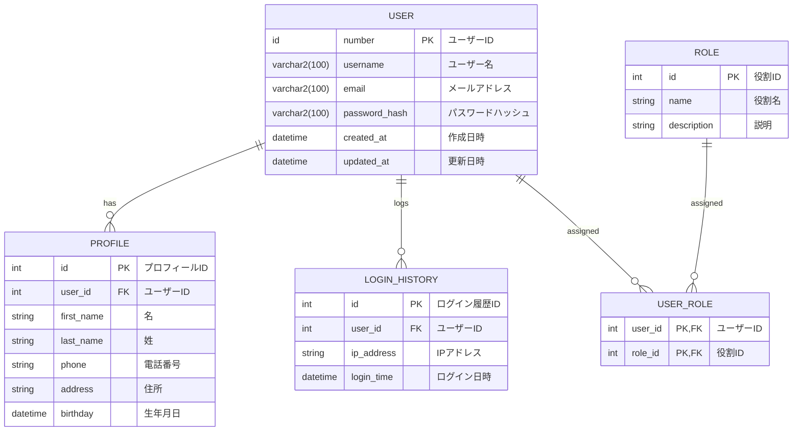
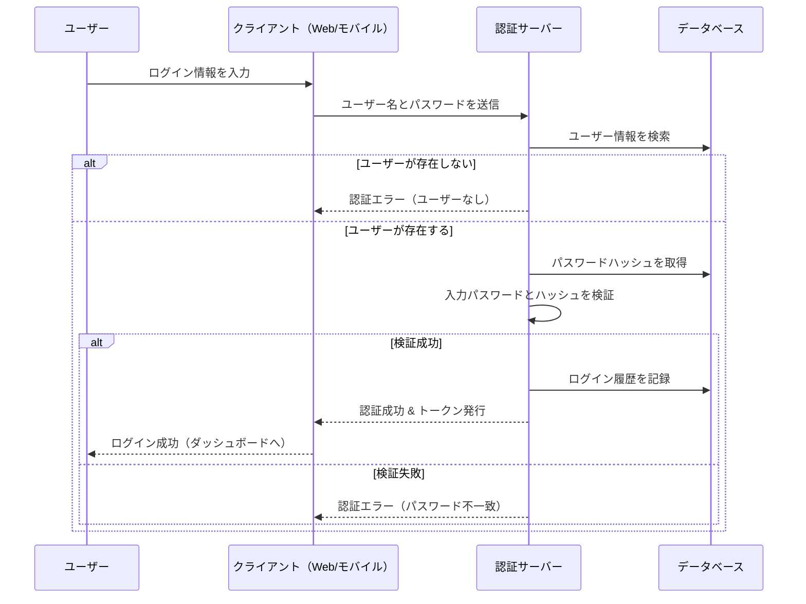

# Marmaidテスト

```mermaid
erDiagram
    USER {
        id number PK "ユーザーID"
        varchar2(100) username "ユーザー名"
        varchar2(100) email "メールアドレス"
        varchar2(100) password_hash "パスワードハッシュ"
        datetime created_at "作成日時"
        datetime updated_at "更新日時"
    }

    PROFILE {
        int id PK "プロフィールID"
        int user_id FK "ユーザーID"
        string first_name "名"
        string last_name "姓"
        string phone "電話番号"
        string address "住所"
        datetime birthday "生年月日"
    }

    ROLE {
        int id PK "役割ID"
        string name "役割名"
        string description "説明"
    }

    USER_ROLE {
        int user_id PK, FK "ユーザーID"
        int role_id PK, FK "役割ID"
    }

    LOGIN_HISTORY {
        int id PK "ログイン履歴ID"
        int user_id FK "ユーザーID"
        string ip_address "IPアドレス"
        datetime login_time "ログイン日時"
    }

    USER ||--o{ PROFILE : has
    USER ||--o{ LOGIN_HISTORY : logs
    USER ||--o{ USER_ROLE : assigned
    ROLE ||--o{ USER_ROLE : assigned

```

```mermaid
sequenceDiagram
    participant User as ユーザー
    participant Client as クライアント（Web/モバイル）
    participant Server as 認証サーバー
    participant DB as データベース

    User->>Client: ログイン情報を入力
    Client->>Server: ユーザー名とパスワードを送信
    Server->>DB: ユーザー情報を検索
    alt ユーザーが存在しない
        Server-->>Client: 認証エラー（ユーザーなし）
    else ユーザーが存在する
        Server->>DB: パスワードハッシュを取得
        Server->>Server: 入力パスワードとハッシュを検証
        alt 検証成功
            Server->>DB: ログイン履歴を記録
            Server-->>Client: 認証成功 & トークン発行
            Client-->>User: ログイン成功（ダッシュボードへ）
        else 検証失敗
            Server-->>Client: 認証エラー（パスワード不一致）
        end
    end

```

